```{r setup, include=FALSE}
options(htmltools.dir.version = FALSE)
knitr::opts_chunk$set(echo = TRUE)
library(patchwork) #devtools::install_github("thomasp85/patchwork")
library(tidyverse)
theme_set(theme_minimal(12))
```

## About me and my work

.pull-left[

Athos Damiani, 31, Statistician from University of São Paulo, Brazil. R user since 2009. 
<hr/>
Currently working on my Master's on the theme:

<div align="center">
<strong style = "color: red">Automatic Bird Species Recognition Based on Their Songs</strong>
</div>

.small[
- Approach: Supervised Machine Learning
- Orientator: Prof. Doctor Linilson R. Padovese
- Co-orientator: Prof. Doctor Paulo Hubert
]
]

.pull-right[

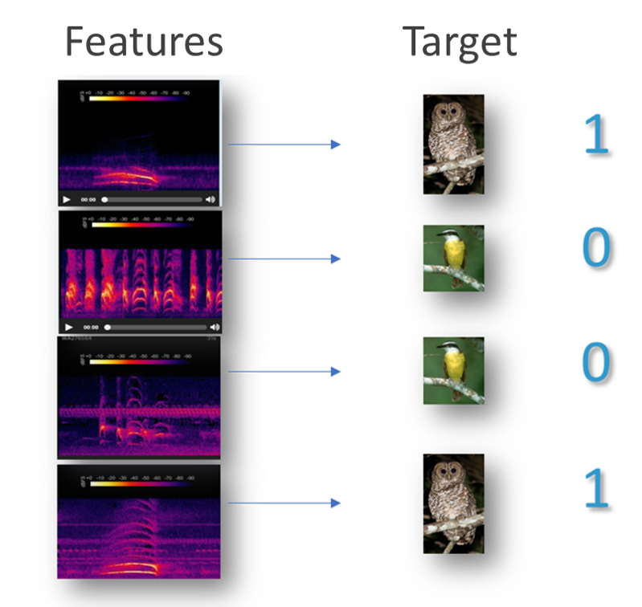

]

---

## Motivation


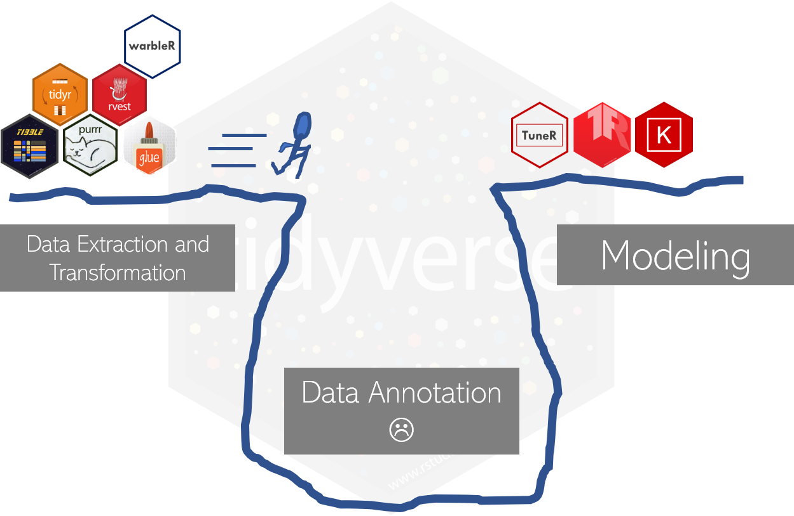


---

## Motivation


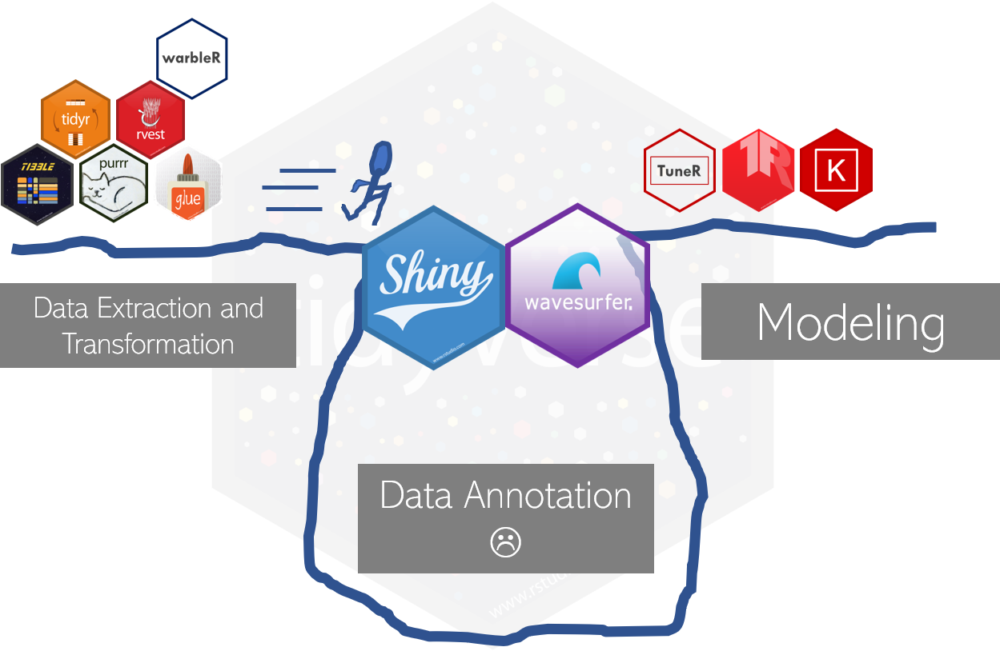


---

## wavesurfer.js

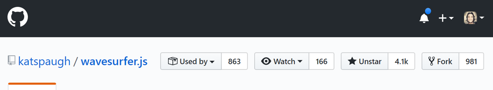

#### "A customizable audio waveform visualization, built on top of Web Audio API and HTML5 Canvas."

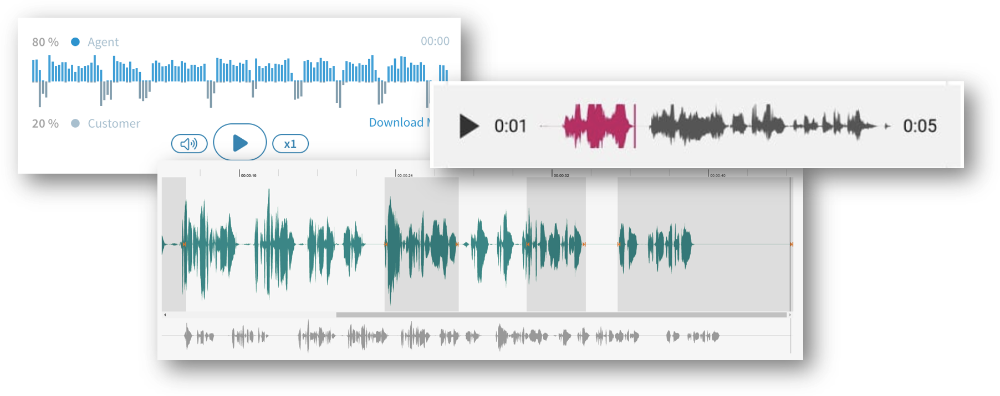


---

## library(wavesurfer)

HTML widget for wavesurfer.js

```{r, eval=FALSE}
# shiny UI

wavesurfer("wavs_folder/wav_file.wav") %>% # or .mp3
  ws_annotator(labels = c("birdsong", "silence", "insect")) %>% #<<
  ws_minimap() %>%
  ws_cursor()
```

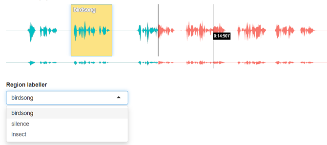

---

## library(wavesurfer)

HTML widget for wavesurfer.js

```{r, eval=FALSE}
# shiny UI

wavesurfer(
  "wavs_folder/wav_file.wav", # or .mp3
  visualization = 'spectrogram' #<<
) %>%
  ws_annotator(labels = c("birdsong", "silence", "insect")) %>% 
  ws_minimap() %>%
  ws_cursor()
```

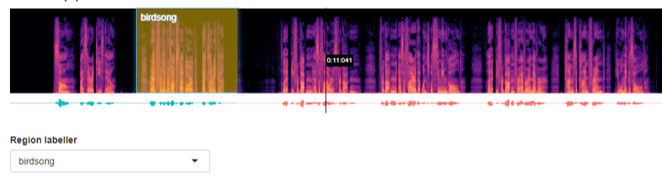

---

## annotator_app()

Built-in shiny app for audio annotation.

.pull-left[
```{r, eval = FALSE}
annotator_app(
  "path/to/wav/files",
  "path/to/store/annotations"
)
```

### RDS layout (each row is a region)

```{r, echo=FALSE}
readRDS("rds/example.rds") %>% 
  mutate(region_id = gsub("wavesurfer_.{5}", "", region_id)) %>%
  head(3) %>%
  knitr::kable(format = "html", digits = 1) %>%
  kableExtra::kable_styling(full_width = FALSE, font_size = 13)
```


]

.pull-right[
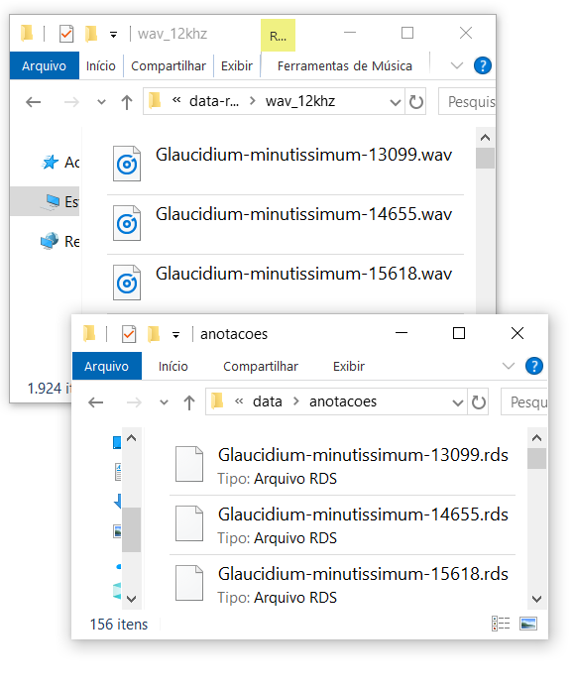
]


---

## annotator_app()

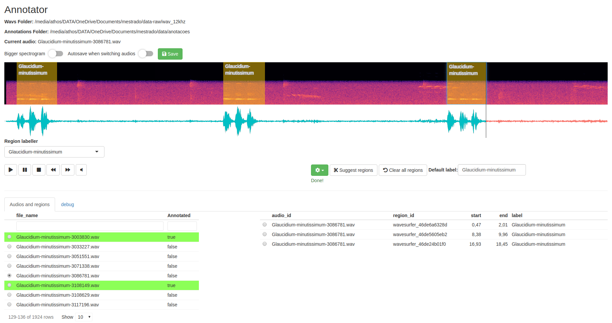


---

## annotator_app()

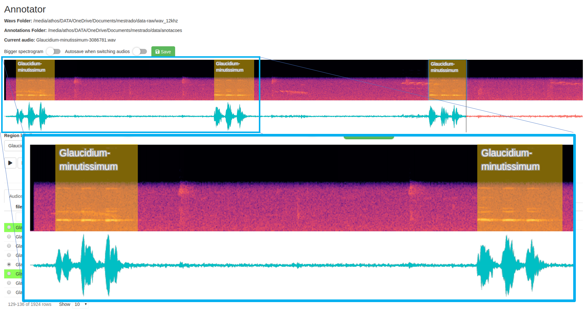


---

## annotator_app()

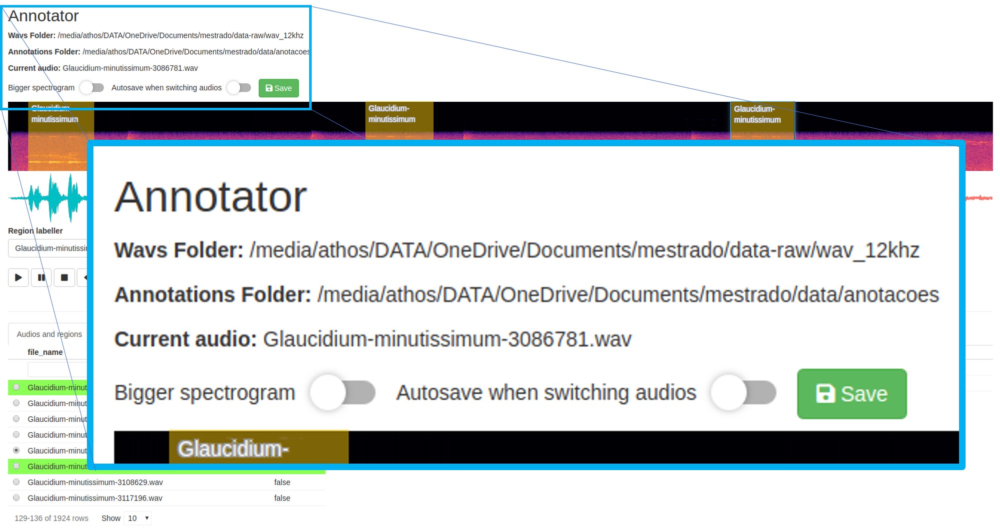

---

## annotator_app()

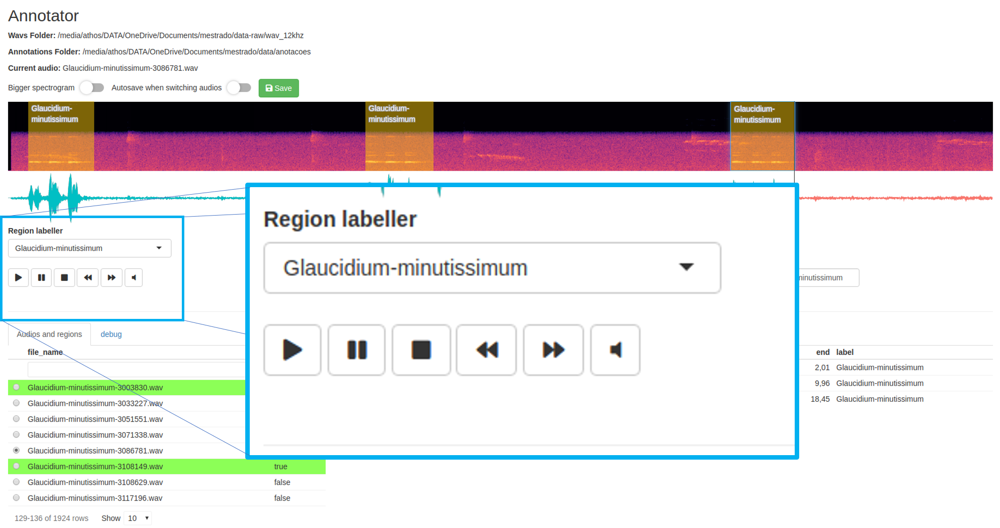
---

## annotator_app()

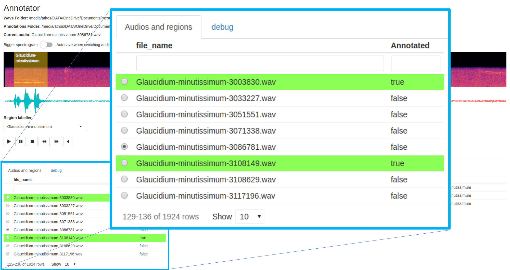

---

## annotator_app()

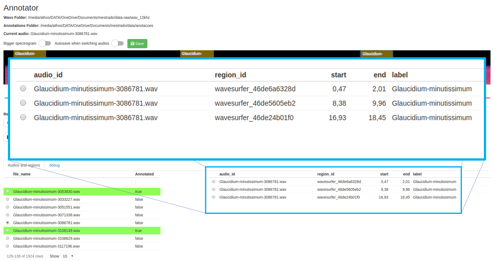


---

## annotator_app()

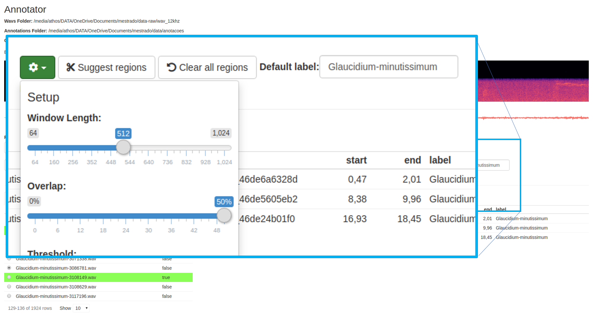

powered by `warbleR::auto_detec()`

---

## annotator_app()

pros

- Built in shiny for a better UX
- One can build a collaborative annotation app
- Two inputs (two folders)
- helper features like region suggestor (powered by `warbleR::auto_detec`)

cons

- X axis annotation only
- Need of shiny skills for fancier ideas


---
class: center, middle, inverse

## Thank You Very Much!

[`r shiny::icon("github")` `Athospd/wavesurfer`](http://github.com/Athospd/wavesurfer)

`r shiny::icon("twitter")` `@athos_damiani`

`r shiny::icon("envelope")` `athos_damiani@curso-r.com`
